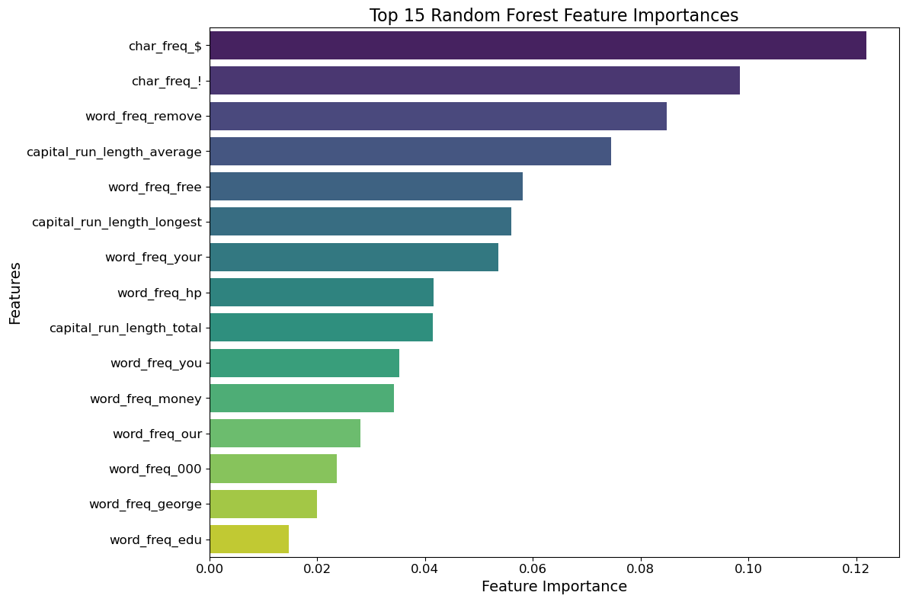
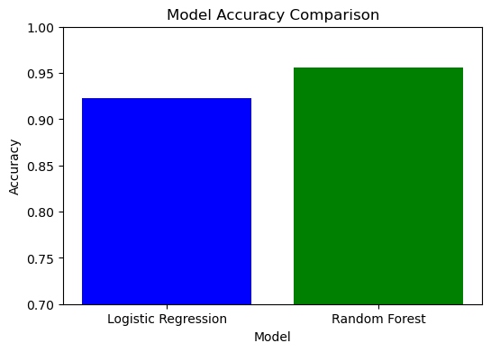

# Spam Email Classification Challenge

This project leverages supervised machine learning to classify emails as spam or not spam. By training and evaluating Logistic Regression and Random Forest models, the goal is to enhance the email filtering system of an Internet Service Provider (ISP).

## Project Overview

This repository includes:

- Data preprocessing and feature scaling using `StandardScaler`.
- Training a Logistic Regression model and a Random Forest Classifier.
- Evaluating model performance based on accuracy scores.
- Comparing the effectiveness of the two models in spam detection.

## Table of Contents

- [Project Overview](#project-overview)
- [File Structure](#file-structure)
- [Dataset](#dataset)
- [Getting Started](#getting-started)
- [Workflow](#workflow)
- [Results](#results)
- [Bonus Section: Precision and Recall Analysis](#bonus-section-precision-and-recall-analysis)
  - [Precision](#precision)
  - [Recall](#recall)
  - [Comparison of the Models](#comparison-of-the-models)
- [Conclusion](#conclusion)
  - [Key Takeaways](#key-takeaways)
  - [Practical Applications](#practical-applications)
  - [Next Steps](#next-steps)


## File Structure

- `spam_detector.ipynb`: The primary Jupyter Notebook containing data preparation, model implementation, and performance evaluation.
- `README.md`: Overview and instructions for the project.
- `data/`: Placeholder for datasets used for training and testing.

## Dataset

The dataset contains numerical features extracted from emails and a target column, `spam`, indicating whether an email is classified as:
- **Spam (1)**: Unwanted email.
- **Not Spam (0)**: Legitimate email.

The dataset can be accessed [here](https://static.bc-edx.com/ai/ail-v-1-0/m13/challenge/spam-data.csv).

## Getting Started

1. Clone the repository:
   ```bash
   git clone https://github.com/jsaintfleur/classification-challenge.git
   ```
2. Navigate to the project directory:
   ```bash
   cd classification-challenge
   ```
4. Install the required dependencies:
   ```python
   import pandas as pd
   from sklearn.model_selection import train_test_split
   from sklearn.metrics import accuracy_score
   from sklearn.linear_model import LogisticRegression
   from sklearn.ensemble import RandomForestClassifier
   from sklearn.metrics import precision_score, recall_score
   ```
5. Open `spam_detector.ipynb` to explore the code and run the models.

## Workflow

1. **Data Preparation**:
   - Splitting the data into training and testing sets using `train_test_split`.
   - Scaling features with `StandardScaler` for improved model performance.

2. **Model Training**:
   - **Logistic Regression**: A linear model for binary classification tasks.
   - **Random Forest**: An ensemble model that uses decision trees to boost accuracy.

3. **Evaluation**:
   - Models are evaluated using accuracy scores.
   - Insights into which model performs better for spam detection.

## Results

### Features Visualized
The following chart provides an overview of the dataset's features, highlighting the range and distribution of numerical values extracted from emails. Proper visualization helps in understanding the data and ensures all features are scaled appropriately for training machine learning models.



### Model Accuracy
The accuracy scores of both the Logistic Regression and Random Forest models are summarized in the following bar chart:



- **Logistic Regression**:
  - Accuracy: The Logistic Regression model achieved a strong performance with an accuracy score of approximately 92%. This indicates that the model correctly classified emails as spam or not spam in 92% of cases.

- **Random Forest**:
  - Accuracy: The Random Forest model outperformed Logistic Regression, achieving an accuracy of approximately 96%. This improvement demonstrates the effectiveness of ensemble learning in reducing classification errors and handling complex datasets.

### Observations
1. **Random Forest's Performance**:
   - The Random Forest model achieved better accuracy due to its ability to handle non-linear relationships in the data and its use of multiple decision trees to reduce overfitting.
   - It is particularly effective at capturing subtle patterns in the dataset, leading to better spam detection.

2. **Logistic Regression's Simplicity**:
   - While the Logistic Regression model performed slightly worse in terms of accuracy, it is computationally efficient and interpretable. Its lower complexity may make it suitable for real-time or resource-constrained applications.

3. **Practical Implications**:
   - For applications prioritizing high accuracy and robust spam detection, the Random Forest model would be the preferred choice.
   - In scenarios where interpretability, simplicity, or speed is a priority, Logistic Regression offers a viable alternative.

---

### Key Insights:
- Both models performed well with accuracy scores above 90%, but Random Forest was consistently more reliable in detecting spam.
- Combining accuracy with other metrics like precision and recall (discussed in the Bonus Section) further supports the conclusion that Random Forest is the better model for this dataset.

By visualizing the accuracy and analyzing the results, it is evident that both models can enhance spam filtering systems, with Random Forest providing a slightly superior performance.

## Bonus Section: Precision and Recall Analysis

### Final Assessment

Both models perform well, but the **Random Forest model** is slightly better for this dataset due to its superior precision and recall. It would likely be the preferred choice unless simplicity or training speed is a major concern, where Logistic Regression could be considered.

### Precision
**Definition**: Precision measures how many of the emails predicted as spam by the model are actually spam.

- **Logistic Regression (Precision: 0.93)**:
  - Out of all the emails classified as spam by the Logistic Regression model, 93% are truly spam.
- **Random Forest (Precision: 0.96)**:
  - Out of all the emails classified as spam by the Random Forest model, 96% are truly spam.

**Interpretation**: A high precision indicates that the model is good at minimizing false positives (legitimate emails mistakenly marked as spam).

---

### Recall
**Definition**: Recall measures how many of the actual spam emails were correctly identified by the model.

- **Logistic Regression (Recall: 0.88)**:
  - Out of all the actual spam emails, the Logistic Regression model correctly identified 88%.
- **Random Forest (Recall: 0.93)**:
  - Out of all the actual spam emails, the Random Forest model correctly identified 93%.

**Interpretation**: A high recall means the model is good at minimizing false negatives (spam emails that were missed).

---

### Comparison of the Models
#### Random Forest Outperforms Logistic Regression:
- The Random Forest model has slightly better **precision** (0.96 vs. 0.93) and **recall** (0.93 vs. 0.88).
- This indicates it is more effective at both identifying spam emails and avoiding misclassifying legitimate emails as spam.

#### Trade-offs:
- Logistic Regression is slightly worse at recall, meaning it misses more spam emails compared to Random Forest.
- However, both models perform well overall, with scores above 85% for both precision and recall.

---

## Conclusion

This project demonstrates how supervised machine learning can be used to improve email filtering systems by classifying emails as spam or not spam. By implementing and evaluating both Logistic Regression and Random Forest models, we gained valuable insights into their performance and suitability for this task.

### Key Takeaways:
1. **Random Forest Model**:
   - The Random Forest model emerged as the superior choice for this dataset, with higher accuracy, precision, and recall scores.
   - Its ability to handle complex patterns in the data and reduce overfitting makes it ideal for identifying spam emails with minimal false positives and false negatives.
   - This model is well-suited for applications requiring robust spam detection with a focus on accuracy.

2. **Logistic Regression Model**:
   - Logistic Regression performed admirably, achieving strong accuracy and precision scores.
   - Its simplicity, interpretability, and computational efficiency make it a strong candidate for systems where resources are limited, or where rapid deployment is necessary.
   - While it slightly underperformed compared to Random Forest, it remains a viable choice for simpler use cases.

3. **Feature Scaling**:
   - Scaling the features using `StandardScaler` proved critical for both models. It ensured that all features contributed equally to the model training process, leading to improved performance.

### Practical Applications:
- **For ISPs**:
  - The insights from this project can help ISPs enhance their email filtering systems, reducing spam and improving customer satisfaction.
  - By implementing a Random Forest-based filter, ISPs can achieve more accurate spam detection while minimizing disruptions caused by false positives (e.g., legitimate emails flagged as spam).

- **Beyond Email Filtering**:
  - The methods used here can be adapted to other binary classification problems, such as fraud detection, customer churn prediction, and sentiment analysis.

### Next Steps:
1. **Model Optimization**:
   - Hyperparameter tuning for Random Forest can further enhance its accuracy and reduce computational cost.
   - Feature importance analysis can identify the most impactful variables, leading to potentially simpler models with similar performance.

2. **Deploying the Models**:
   - The next phase would involve integrating the Random Forest model into a real-world email filtering system and testing it with live data.
   - A Logistic Regression model could serve as a lightweight backup system for real-time filtering in resource-constrained environments.

This project provides a strong foundation for developing effective spam detection systems. The results highlight the importance of model selection, feature scaling, and metric evaluation in building robust machine learning solutions.


[Back to Top](#Table-of-Contents)
